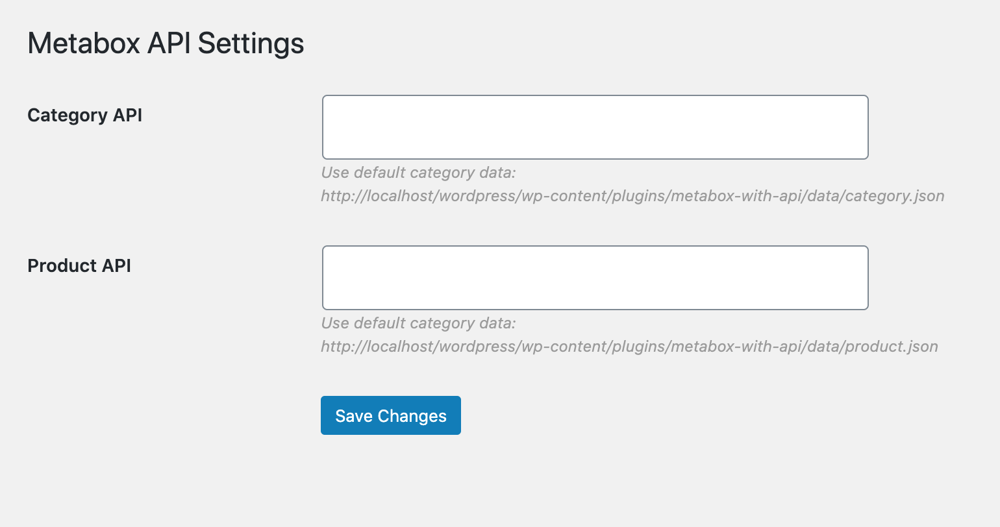
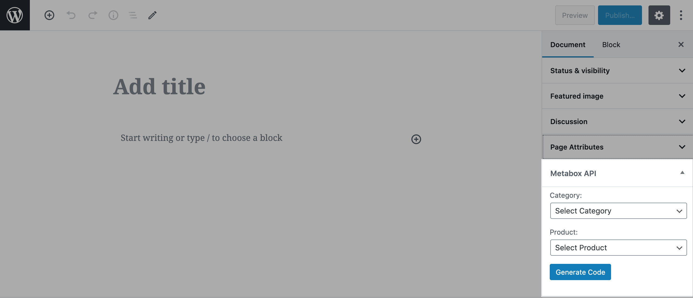

# Metabox with API
The plugin captures the data from category & product api. The Metabox is created for the post and page. The product shortcode is generate based on the selection of category and product.

## Description
The objective of the plugin is to generate product button based on the data fetched from the API. The api data should be generated in the same manner as provided by the plugin (refer cateogory.json & product.json, included in "data" directory).

Once you activate the plugin, two tables `wp_metabox_categories` and `wp_metabox_products` are created. The "Metabox API setting" option (under the "Setting" section) allows to store category api url and product api url. After storing both APIs, there is option to fetch the data. It means category and product data are stored in the respective database table (i.e. `wp_metabox_categories` and `wp_metabox_products`). We can also fetch the data at regular period of time. The plugin supports two level of category only (i.e. Parent and child category).

The plugin also generate the metabox (named "Metabox API") on the post or the page. Once you select the category from "Category" dropdown / select box, the product specific to that category will be populated to "Product" dropdown / select box. After selecting the product, you can generate the shortcode by clicking "Generate code" button. The generated shortcode can be used on any post or page which will display as product button in frontend. Anyone can easily modify the output of the generated shortcode.

If anyone want to modify the output of the shortcode or the attributes/fields of "cateogory" & "Product" APIs, can reach out to me. Please provide the feedback or suggestion to me.

## Installation
1. Just Install and Activate It
2. Download metabox-with-api.zip and extract it to "Plugin" directory of wordpress.

## FAQ
**Question:** Is there any configuration require for this plugin?

**Answer:** No

##
**Question:** Is all features of this plugin completely free? 

**Answer:** Yes
##

**Question:** Where can I get support?

**Answer:** For support, please contact at saumil.nagariya@gmail.com.
##

**Question:** Where can I report bug?

**Answer:** For reporting related bugs, please contact at saumil.nagariya@gmail.com.
##

**Question:** Where can I find the sample of Category & Product API?

**Answer:** You can find the sample json for Category(category.json) & Product(product.json) API inside "Data" directory.
##

## Screenshots
1. Metabox API Setting page. 
2. Metabox API Setting page : Stored api and fetch option. 
3. Metabox API generated while adding/editing the post. 
4. Metabox API generated while adding/editing the page. 
5. Metabox API displays the generated shortcode for product. 
6. Multiple shortcode can be included on the specific post or page. 
7. The product button will be created on frontend. 

## Changelog
### 1.0
* Initial release.
* Category & Product API (refer category.json & product.json inside "data" directory)

## Upgrade Notice
No need to upgrade, you only need to install plugin. This is the initial version of plugin.
